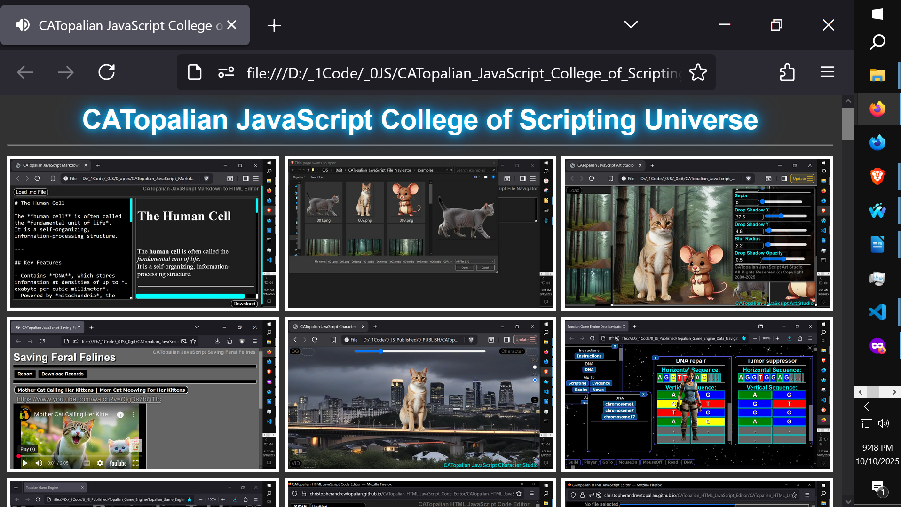
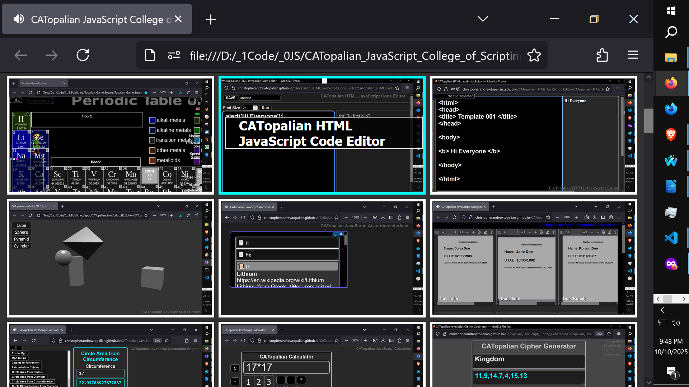
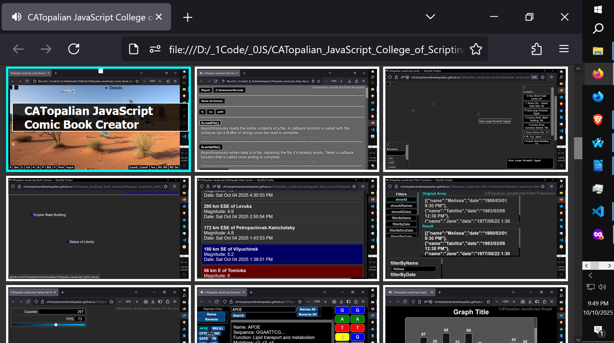

# CATopalian JavaScript College of Scripting Universe
A JavaScript app that displays a grid of images that are links to many useful JavaScript applications 

---

Video: https://www.youtube.com/watch?v=LJYrXyXA0Yo

### How to Download this App
1. **Click** the green **Code Button** on this github page
2. Choose **Download ZIP**
3. **Save** the **Zip File**
4. **Extract All**
5. **Double click** the **HTML file** to start the App

---

Happy Scripting :-)

//----//  

// Dedicated to God the Father  
// All Rights Reserved Christopher Andrew Topalian Copyright 2000-2025  
// https://github.com/ChristopherTopalian  
// https://github.com/ChristopherAndrewTopalian  
// https://sites.google.com/view/CollegeOfScripting

